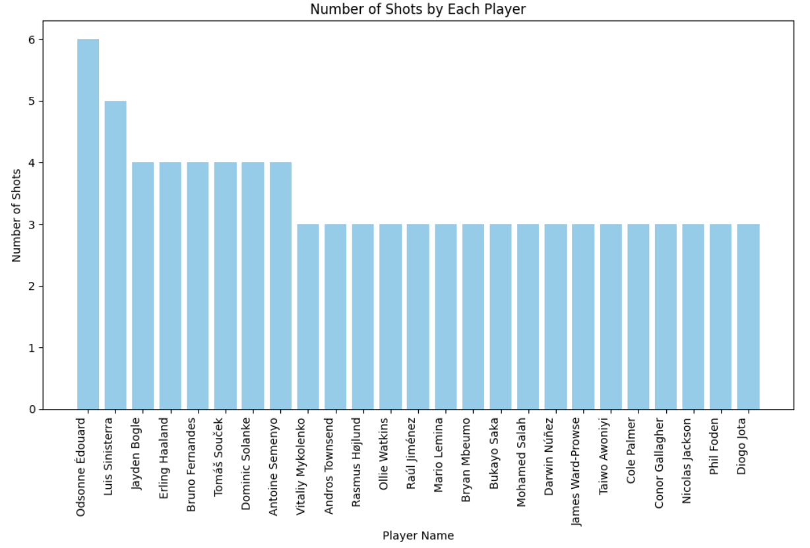

# Soccer Shot Data Analyzer

This Python script scrapes and analyzes soccer shot data from the SofaScore website using their unofficial API. It provides insights into shots taken during specific matches and visualizes player-specific shot data on a soccer pitch.

---

## Prerequisites

Make sure the following Python packages are installed:

```bash
pip install requests beautifulsoup4 pandas numpy matplotlib mplsoccer
```

---

## Getting Started

1. Clone or download the repository.
2. Run the script using any Python interpreter.
3. Follow the prompts to enter match numbers and player names.
4. View the scraped data and visualizations.

---

## Features and Code Structure

### 1. Scraping SofaScore API

Uses the `requests` library to fetch shot data for selected matches.

Extracts:
- Player name
- Shot type
- Match situation
- Coordinates
- xG (expected goals)
- xGOT (expected goals on target)

---

### Example: Number of Shots by Each Player



---

### 2. Creating DataFrames

Uses `pandas` to create a clean DataFrame of all relevant shot data.

Each match’s shots are neatly structured for further analysis.

---

### 3. Visualizing Shot Data

- Uses `mplsoccer` to draw a pitch and overlay shots.
- Color-coded by result (goal, miss, save, block, post).
- You can input a player’s name to filter shots.

---

## Acknowledgments

- [SofaScore](https://www.sofascore.com/) for match data.
- Libraries used: `requests`, `beautifulsoup4`, `pandas`, `numpy`, `matplotlib`, `mplsoccer`

---

## License and Disclaimer

This project is intended for educational and analytical purposes only.

- Respect SofaScore’s [terms of service](https://www.sofascore.com/news/terms-of-service/)
- The developer is not affiliated with SofaScore